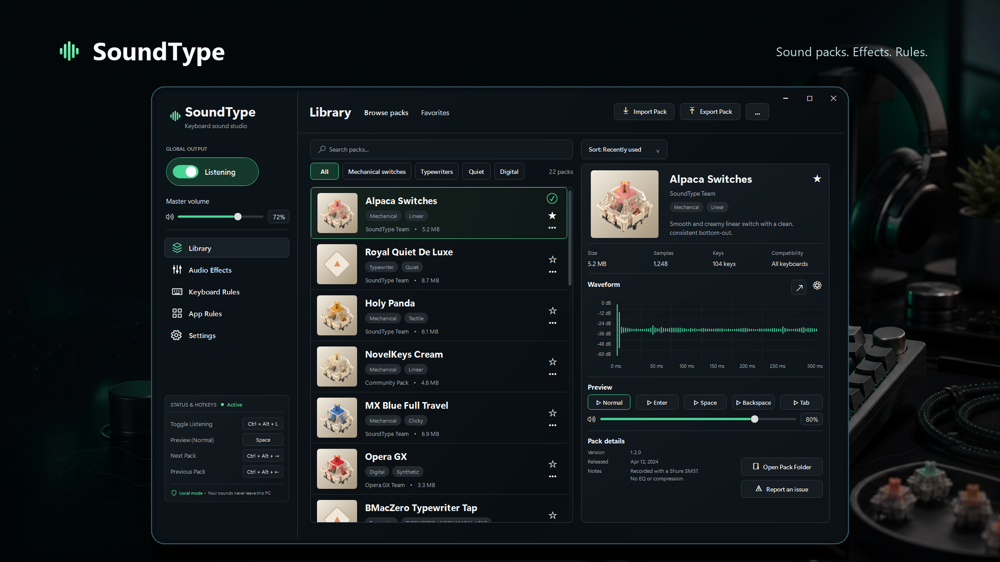

# SoundType

**A keyboard sound studio for Windows.**

SoundType makes typing feel a little more alive. Choose from mechanical switches,
typewriters, quiet taps, and digital sound packs, then tune the sound until it
fits your desk, your mood, and the apps you use every day.



## What It Does

SoundType runs quietly in the background and plays a sound when you type. You can
keep it subtle, make it satisfyingly mechanical, or switch to a warm typewriter
feel when you want a little character.

- Browse built-in sound packs for switches, typewriters, quiet keys, and digital taps.
- Preview sounds before you commit to a pack.
- Adjust volume, pitch, EQ, and mix controls.
- Set rules for specific apps, games, calls, or streaming setups.
- Keep it in the tray so it is there when you want it and out of the way when you do not.
- Import and export `.soundpack` files.

## Privacy

SoundType is built to feel local and quiet.

It reacts to key presses so it can play sound, but it does not store typed words,
typed characters, passwords, or key history. Your sound settings live on your PC,
and keystrokes are not sent to a server.

Read the short privacy note here: [docs/PRIVACY.md](docs/PRIVACY.md).

## Download

The portable Windows build is published from this repository's
[GitHub Releases](https://github.com/M3RCU3Y/SoundType/releases).

Download the latest `SoundType-win-x64-Release-portable.zip`, extract it, and run
`SoundType.exe`.

## Using SoundType

1. Open SoundType.
2. Pick a sound pack from the Library.
3. Preview the pack and adjust the volume.
4. Fine-tune effects if you want a softer, sharper, warmer, or cleaner feel.
5. Add app rules when certain apps should be quieter, louder, or muted.

The default toggle hotkey is `Ctrl+Alt+K`.

## Sound Packs

SoundType includes a mix of mechanical switch profiles, typewriter recordings,
and digital keyboard sounds. Some packs include press and release samples for a
more natural typing feel.

The bundled audio uses sourced material and attribution where required. See
[THIRD_PARTY_NOTICES.md](THIRD_PARTY_NOTICES.md) for details.

## For Developers

SoundType is a WPF desktop app built with .NET.

Run it locally:

```powershell
.\.tools\dotnet\dotnet.exe run --project .\src\SoundType.App\SoundType.App.csproj
```

Build and test:

```powershell
.\.tools\dotnet\dotnet.exe build .\SoundType.sln
.\.tools\dotnet\dotnet.exe test .\SoundType.sln
```

Create the portable release:

```powershell
powershell -ExecutionPolicy Bypass -File .\tools\publish-portable.ps1
```

The directly launchable app is written to:

```text
artifacts\publish\SoundType\SoundType.exe
```

The release zip and checksum are written to:

```text
artifacts\SoundType-win-x64-Release-portable.zip
artifacts\SoundType-win-x64-Release-portable.sha256
```

More project notes:

- [Development guide](docs/DEVELOPMENT.md)
- [Packaging guide](docs/PACKAGING.md)
- [Sound pack format](docs/SOUND_PACK_FORMAT.md)
- [Manual QA checklist](docs/QA_CHECKLIST.md)
- [Roadmap](docs/ROADMAP.md)
